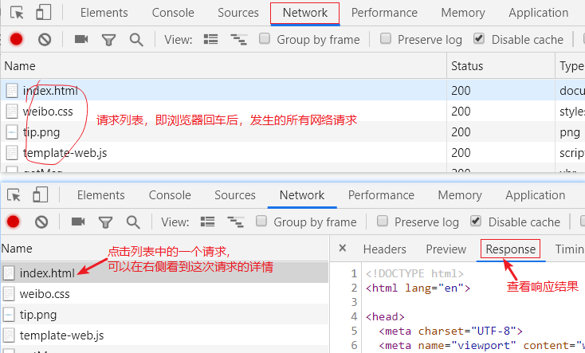
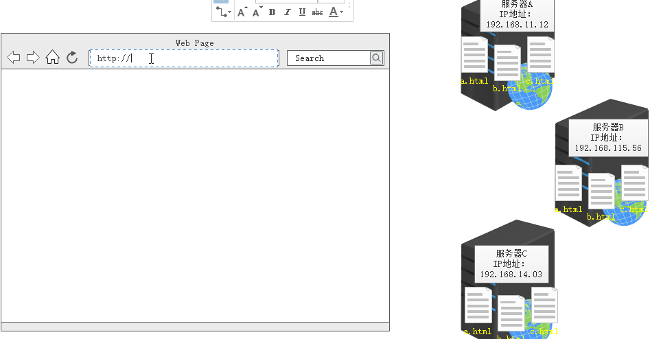
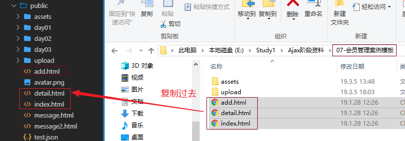

## 课程介绍

- 目标
  
- 了解现阶段，我们即将要学习什么
  
- 案例对比

    - 之前做的案例都是 `单机程序`。
    - 现阶段及之后的案例都类似真正的网站

    >两个案例为什么有非常大的区别，是因为现阶段的案例使用了ajax、服务器、http等等新的技术。

## 了解上网的过程（理解）

你知道当我们在网页浏览器（browser）的地址栏中输入 URL时，页面是如何呈现的吗？


页面当然不能凭空显示出来。我们看到的页面也是像我们一样的前端人员写出来的页面，那么这些页面在哪里呢？其实先不用想的很复杂，这些页面不是我们写的，肯定不在自己的电脑上，肯定是谁写的页面就在谁的电脑上呗。

比如，老师演示的留言板页面就在老师的电脑上，百度、新浪、腾讯等公司的页面肯定也在人家的电脑上。

问题是，别人写的页面，为什么通过自己的浏览器也能看到呢？

原因是这样的，根据 浏览器地址栏中指定的URL（形如 `http://www.baidu.com/index.html`），浏览器首先根据指定的 域名^①^ (`www.baidu.com`）找到存放百度页面的计算机，向百度的计算机“索要”指定的文件（`index.html`），百度的计算机就会把index.html 中的代码返回给我们的浏览器，注意，只是把index.html中的代码返回给我们的浏览器，并不是把这个文件下载下来。浏览器刚好是一个可以显示页面的工具，所以浏览器将得到的代码解析^②^后，我们最终就看到了百度的页面了。


下面对上述内容中几个新知识点做一个解释：

- 域名
    - 域名的作用和IP地址一样，可以找到网络中的一台计算机
    - IP地址是标识网络设备的唯一标识，同一个网络中的计算机，IP地址绝对不会重复
- 解析
    - 这里解释的意思是，浏览器把代码（HTML、css等等代码）呈现到页面上

## 细化上网的过程（理解）

前面简单阐述了上网的过程，使用的语言大多都是大白话，接下来我们说一下上网的过程中涉及到的一些转义术语。

- 客户端
    - 在上网的过程中，浏览器还有另外一个名字，叫做客户端。

- 服务器
    - 存储百度网页的那台计算机，叫做服务器，或者叫做Web服务器。
- 请求
    - 请求，或者叫做发送请求，指的是客户端向服务器“索要”页面的过程
- 响应
    - 即回应，当客户端向服务器发送请求之后，服务器会根据客户端的请求，将客户端请求文件的源代码返回给浏览器，这一过程称之为响应。
- 资源
    - 服务器上存储的东西都可以叫做资源，比如html文件、css文件、图片文件、js文件、音频视频文件、字体文件等等。


网络请求时（上网时），必定是一端担任客户端角色，另一端担任服务器端角色

通过浏览器工具，能够查看每一次网络请求：



下面，我们来看一个具体的示例。



可能你每天都在使用客户端，最常见的客户端就是浏览器。浏览器一个页面时（比如http://192.168.115.56:4000/index.html），浏览器会向服务器（服务器IP地址为`192.168.115.56`）发送一个请求，服务器会去寻找客户端所期望的`index.html`，如果成功，就将`index.html`的内容及一些其他信息放在响应中发送给浏览器。最后浏览器将服务器响应的结果呈现在我们眼前。

## 了解服务器

Web资源（html文件、css文件、js文件、json文件等等...）都是存储在Web服务器上的。

Web服务器会对客户端的请求进行处理并提供响应，术语“Web服务器”可以用来表示Web服务器的软件，也可以用来表示提供Web页面的特定设备或计算机，下文都指后者。

Web服务器有着不同的风格、形状和尺寸。

服务器可以从网络运营商（阿里云、腾讯云、百度云...）租，也可以自己购买。下图是淘宝上搜索“服务器”的截图


但不管功能有何差异，所有的Web服务器都能够接收客户端的请求，将服务器端的内容回送给客户端。

总体来说，Web服务器的作用：

- 存储Web资源，资源的概念很广，这里先理解为服务器上的html文件、css文件、js文件、图片文件等等。
- 提供Web服务，理解为能够接收并处理客户端的请求，并做出回应

Web服务器和普通计算机的区别

- 除了硬件设施的区别之外，`Web服务器 === 普通计算机 + 服务器软件`

### 服务器软件

服务器和个人计算机的本质区别是，服务器上安装了服务软件。常见的服务软件非常多，比如：

- Apache
- Nginx
- IIS
- ......

凡是叫做服务器的，肯定都安装了服务软件。

我们上课使用的服务软件是使用Node编写的一个小软件，没有名字（）

> 服务器 = 计算机 + 服务软件


## 搭建W

## 重点）

### 如何拥有服务器

学习阶段，无需购买服务器或租赁服务器，可以像老师一样，把自己的计算机用作服务器即可。

前面介绍到，`服务器 = 计算机 + 服务软件`

- 使用的服务器就是我们自己的计算机
- 使用的服务软件是使用Node编写的一套程序。

开机，运行服务软件，将资料中的ajax文件夹，用编辑器打开，在`app.js`上右键，选择在终端中打开，最后在出现的终端面板中，输入`node app.js`，按回车即表示服务启动了，见下图。


要点说明：

- 开启服务后，终端面板可以关闭。关闭终端面板并不表示关闭服务。
- 服务不能重复启动，否则报错。
- 我们自己创建的文件必须放到 `public` 文件夹中。
- ==访问 `public` 里面的文件，必须用访问服务器的方式去访问，即必须使用IP地址或域名访问，不能以文件方式打开==

试着访问服务器上的资源：

- 在 `public` 文件夹创建一个 html 文件，然后使用浏览器访问它

## 初识Ajax（重点）

前面我们通过浏览器输入 IP或域名，按下回车的方式，可以向服务器发送请求，并能接收到服务器响应的结果，浏览器的这项可以发送请求并接收结果的功能，可以认为是浏览器本能的行为。


Ajax是一种技术，通过这种技术，也可以实现客户端和服务器的请求响应过程。这一技术的实现，只需要浏览器执行一小段JS代码即可。


> 使用Ajax技术，无需浏览器地址栏回车、刷新等，只需要让浏览器执行一段JS代码就可以实现请求响应过程了，言外之意是使用Ajax技术，页面是不会刷新的

## 小试牛刀（重点）

接下来，我们先快速实现一次Ajax请求。

具体做法是，在 `public` 文件夹中，随便创建一个 html文件，比如叫做 `01-ajax.html` ，我们就在这个文件中写一段能够实现Ajax请求的JS代码，为了快速体验，我们可以借助于jQuery。

在 `01-ajax.html` 中，加入如下代码

```html
<script src="./assets/jquery.js"></script>
<script>
    $.ajax({
        // 属性: 值
        // url: 'http://localhost:4000/test.txt', // 请求的服务器上的资源的地址
        url: '/test.txt', // 简化的地址
        // success属性，可以接收服务器响应的结果
        success: function (result) {
            console.log(result);
        }
    });
</script>
```

浏览器，请求 01-ajax.html 即可看到Ajax请求了。


## 认识数据接口（重点）

其实，在通过Ajax向服务器发送请求的时候，不但可以请求服务器上的文件资源，也可以请求接口，url也可以这样写：

```html
<script src="./assets/jquery.js"></script>
<script>
    $.ajax({
        url: '/common/abc', // 这里这样写
        success: function (result) {
            console.log(result);
        }
    });
</script>
```

通过代码，发现，`public` 文件夹中并没有 `/common/abc` 这个文件，但是运行之后也不会报错。这种非文件的地址，我们把它叫做接口或接口地址。

- 接口，是后端同学提供的，至于如何实现，我们无需关心，那是后端同学的事。
- 接口，也是一个`网址`，通过客户端向这个网址发送请求，可以获取到接口返回的结果。

实际开发中，有很多这样的接口，也有很多提供接口的网站，下图是一个QQ号码测吉凶的接口，通过改变QQ号，接口返回对应的结果。

接口地址：http://japi.juhe.cn/qqevaluate/qq?key=55b50bf0d8b67d6659b535d138df659d&qq=295424589


除此之外，还有很多接口，比如天气信息接口：

[https://www.tianqiapi.com/api/?appid=22449382&appsecret=Vudt9mVQ&version=v1&city=北京](https://www.tianqiapi.com/api/?appid=22449382&appsecret=Vudt9mVQ&version=v1&city=北京)

> 我们把接口看做一个带有返回值的函数即可，通过客户端访问接口，就相当于调用该函数，并可以得到它的返回值。
>
> 有些函数调用需要参数，接口也是如此。

> 对于接口的功能，一般会有一个专门的文档来介绍

## 接口文档（重点）

接口文档中记载了后端同学提供的接口的详细信息，大致包括，接口地址、作用、请求方式、请求参数、响应结果等等。

我们使用的服务器软件中也内置了很多接口，具体可以查看 `接口文档`。

向接口发送请求非常之简单，你只需要会套 `$.ajax()` 这个方法即可。

```js
$.ajax({
    type: '请求方式',
    data: '请求参数',
    url: '接口地址',
    dataType: '响应数据类型',
    success: function (res) {
        // res 就是响应结果
    }
});
```

接口参数可以按下面两种方式来填写，哪一种写法都可以：

- 方式一：`参数=值&参数=值...`
- 方式二：`{参数: 值, 参数: 值, ...}`

> 小知识点，请求参数是客户端额外发送到服务器的数据，告知服务器此次请求的具体信息
>
> 无论使用哪种写法编写请求参数，实际发送到服务器的总是方式一那样的字符串

## 接口应用，完成验证用户名案例

在上网注册的时候，经常会遇到验证用户名是否存在的情况。比如下面图示的是[博客园的注册页面](https://account.cnblogs.com/signup)验证用户名的场景。


我们也可以使用自己的 `/common/checkUser` 接口，完成这样的验证。

> 注意，接口文档告诉我们了，zhangsan、lisi、wangwu 三个用户名已经注册过了

实现过程分析：

- 不再是刷新页面就发送Ajax请求了，应该在input失去焦点时，发送验证用户名的Ajax请求
- 需要验证的用户名不能写死，应该是用户在文本框中输入的值
- 服务器返回的结果，不应该直接console.log了，应该判断后，在页面中给出提示

具体代码：

```html
<input type="text" id="username">
<span></span>

<script src="./assets/jquery.js"></script>
<script>
    // 1. 注册 input的失去焦点事件
    $('input').blur(function () {
        var uname = $(this).val(); // 获取输入框中的值
        // 2. 发送ajax请求，验证用户名
        $.ajax({
            type: 'GET',
            url: '/common/checkUser',
            data: {username: uname},
            // data: 'username=' + uname, // username=xxx
            dataType: 'json',
            success: function (result) {
                console.log(result);
                // 3. 在span标签中给出提示
                $('span').text(result.msg);
            }
        });
    });
</script>
```


## 案例--留言板

### 发送Ajax请求，获取所有的留言

1. 准备工作
    1. 将 `Ajax阶段资料/03-发布微博网页模板（Ajax案例使用）` 中的 `weibo.html`及`css`、`images`文件夹拷贝到`public`文件夹中。
    2. 浏览器访问 localhost:4000/weibo.html，能够看到初始页面。
2. 按照接口文档，套 $.ajax() 方法

### 将数据渲染到页面中

1. 渲染
    1. 就是把从服务器获取的数据，放到页面上显示
2. 具体做法
    1. 将从服务器获取的数据（变量result）循环
    2. 循环过程中，拼接 `li` 标签
    3. 循环之后，把拼接好的所有 `li` 放到 `ul` 中即可

### 单击按钮，实现发布留言

1. 为按钮注册单击事件
2. 事件处理函数中，获取输入框的值（留言人的名字和内容）
3. 按照接口文档，套 $.ajax() 方法
4. 添加留言成功后，让页面显示新的留言
    1. 将前面获取留言的代码封装成函数。
    2. 添加成功之后，调用函数，从新获取数据。
5. 清空输入框的值

## $.ajax() 方法的详解（理解）

### type

1. 意义
    - 表示请求的方式或方法（method）
2. 最常见的两种请求方式
    - GET
    - POST
3. GET和POST的异同
    - 不同点：
        - get  ：获取，得到。这种方式请求用于向服务器请求资源（图片，文件，数据....）。它是最常见的请求方式。它的重点在于，它只是请求，而`不会改变`服务器上的资源。
        - post：派送，投递。这种方式的请求用于向服务器上提交数据，它的重点在于，它`可能会修改`服务器上的资源。
    - 相同点
        - get和post请求都可以在发请求时附带一些数据。例如：根据用户名去检查这个用户是否被占用；在论坛中注册一个账号。
        - get和post请求都能够从服务器上获取返回的数据。

> 实际开发中，接口都是后端同学提供的，所以接口支持哪种请求方式，还得以文档为准。

### data

1. 意义
    - 向接口发送请求的时候，携带的数据，也就是接口文档中的请求参数
2. 写法
    - 对象形式，形如： `{name: 'xxx', content: 'xxx'}`
    - 字符串形式，形如： `name=xxx&content=xxx`

> 无论写法如何，实际上发送给服务器的数据都是 字符串形式。多个请求参数之间，使用 & 符号隔开。GET请求的时候，这个字符串和接口之间使用 ? 隔开

### dataType

1. 意义
    - 服务器响应数据的格式。
    - 指定该项，jQuery会自动将服务器响应的数据处理成JS数据（数组、对象、字符串、布尔等等）
2. 可选的值
    - `json`，它是==最最常见==的数据传输格式。能够以简单的语法表示复杂的数据
    - `text`，表示服务器返回的是文本类型的数据
    - `xml`，表示服务器返回的是xml格式的数据，目前项目中很少使用它了，这里作为了解
    - `jsonp`、`script`、`html`等其他值

> 当我们已经知道了服务器返回数据的格式，则最好指定 `dataType`

### beforeSend

1. 意义

    - 在发送Ajax请求之前，允许我们做一些事情

2. 语法

    ```js
    $.ajax({
        beforeSend: function () {
            // 发送请求之前，你需要做什么？可以写到这里
        }
    });
    ```

### complete

1. 意义

    - 在Ajax请求结束之后，允许我们做一些事情

2. 语法

    ```js
    $.ajax({
        complete: function () {
            // Ajax请求结束了，你想做什么？可以写到这里
        }
    });
    ```

## 原生的Ajax请求

在实际的开发中，我们会直接使用如jquery这样的第三方工具库来调用ajax，而不会自己去手写一个原生的。但对于学习者来说，深入学习原生ajax能帮助我们更好的理解和掌握 。

原生的Ajax实现，是基于浏览器内置对象 `XMLHttpRequest` 提供的API实现的。

### 基本语法（重点）

1. GET方式写法

    ```js
    // 1. 实例化 XMLHttpRequest对象
    var xhr = new XMLHttpRequest();
    // 2. 通过 open(请求方式, url) 方法，设置请求方式和url
    xhr.open('GET', '/common/time');
    // 3. 调用 send() 方法，发送请求。 ---> 此步骤，表示开始发送请求
    xhr.send();
    // 4. 准备一个事件，当请求响应过程结束后，会触发该事件；在事件处理函数中，接收服务器响应的结果
    xhr.onload = function () {
        // 使用 xhr.response; 来接收结果
        console.log(xhr.response);
    }
    ```

    如果有请求参数

    ```js
    xhr.open('GET', '接口地址?参数=值&参数=值....');
    ```

    

2. POST方式写法

    和GET请求相比，多了一行代码，并且请求参数的位置变化了。

    ```js
    var xhr = new XMLHttpRequest();
    xhr.open('POST', '/message/addMsg');
    // 相比GET方式，POST方式多下面一行代码
    xhr.setRequestHeader('Content-Type', 'application/x-www-form-urlencoded');
    xhr.send('name=李白&content=举杯邀明月');
    xhr.onload = function () {
        console.log(xhr.response);
    }
    ```

### ajax中get 和 post 区别（理解）

- get
    - 参数拼接在url（`url?name=1&age=30`）
    - 由于浏览器对url长度的支持（各个浏览器均不同）是有限，所以，它只能附加少量的数据。
- post
    - 要设置请求头: `xhr.setRequestHeader('content-type','application/x-www-form-urlencoded')`
    - 参数写在send()方法中:`send('name=1&age=30')`
    - 相对于get 来说，没有传参大小的限制。

### 用原生的Ajax实现验证用户名案例

实现代码：

```js
document.getElementById('username').onblur = function () {
    // 0. 获取输入框的值
    var uname = this.value;
    // 1. 实例化 XMLHttpRequest对象
    var xhr = new XMLHttpRequest();
    // 2. 通过 open(请求方式, url) 方法，设置请求方式和url
    xhr.open('GET', '/common/checkUser?username=' + uname);
    // 3. 调用 send() 方法，发送请求。 ---> 此步骤，表示开始发送请求
    xhr.send();
    // 4. 准备一个事件，当请求响应过程结束后，会触发该事件；在事件处理函数中，接收服务器响应的结果
    xhr.onload = function () {
        // 使用 xhr.response; 来接收结果
        console.log(xhr.response);
    }
}
```

> 课后，大家可以把留言板案例也用原生的ajax写一写。

### 浏览器中的小问题（了解）

#### readyState 和 onreadystatechange（了解）

既然Ajax请求是一个耗时操作，也就是从开始创建 xhr 对象，然后调用open、调用send发送请求到服务器（耗时）、·（耗时）、接收服务器返回的数据、完全接收到服务器返回的数据，这一整个过程是耗时的操作，即使网速再快也需要一定的时间。

换句话说，在执行Ajax请求响应过程中，要经过好几个阶段，xhr 对象提供了一个属性 readyState ，用它来表示 Ajax请求到哪个阶段了。

输出 xhr.readyState 会得到 0、1、2、3、4几个数字，他们分别表示 Ajax请求响应的各个阶段，每个数字表示的意思如下：

| readyState | 状态描述         | 说明                                                         |
| ---------- | ---------------- | ------------------------------------------------------------ |
| 0          | UNSENT           | 代理（XHR）被创建，但尚未调用 `open()` 方法。                |
| 1          | OPENED           | `open()` 方法已经被调用，建立了连接。                        |
| 2          | HEADERS_RECEIVED | `send()` 方法已经被调用，并且已经可以获取状态行和响应头。    |
| 3          | LOADING          | 响应体（服务器返回的数据）下载中， `responseText` 属性可能已经包含部分数据。 |
| **4**      | **DONE**         | **响应体（服务器返回的数据）下载完成，可以直接使用 `responseText`或response 获取完整的结果。** |

> 一般都不说Ajax请求响应的几个阶段，大多数都说Ajax的几个状态，也就是说readyState表示Ajax请求过程中的几个状态。

------

接下来我们，再看一下onreadystatechange事件。

onload是H5之后新增的事件，在H5之前，都是使用onreadystatechange。

on... 表示一个事件，翻译过来就是“当...时候”，readystate前面说过，是一个数字，表示ajax的状态，change是改变的意思。所以这个事件的意思是，当Ajax状态发生变化的时候，就会触发这个事件。

```js
var xhr = new XMLHttpRequest()；
// 创建对象后，先打印一次XHR对象的状态，此时状态值为0
console.log(xhr.readyState); // 0

// 添加事件onreadystatechange，每当XHR对象的状态发生变化的时候，就会触发这个事件
// 比如
// xhr对象的状态从0-->1，会触发下面的事件
// xhr对象的状态从1-->2，会触发下面的事件
// xhr对象的状态从2-->3，会触发下面的事件
// xhr对象的状态从3-->4，会触发下面的事件
xhr.onreadystatechange = function () {
    console.log(this.readyState); 
    // 输出1/2/3/4
}
// open 方法的第一个参数的作用就是设置请求的 method
xhr.open('POST', '/query-post')
// 设置 Content-Type 为 application/x-www-form-urlencoded，这行代码不用死记硬背，去复制即可
xhr.setRequestHeader('Content-Type', 'application/x-www-form-urlencoded')
// 需要提交到服务端的数据可以通过 send 方法的参数传递
// 格式：name=zhangsan&age=18
xhr.send('name=zhangsan&age=18');
```

------

如果服务器返回的数据量非常大，xhr对象是分块接收数据的，一次性接收一部分（大小不确定），直至接收完毕为止。

注意的是，当xhr对象接收的数据发生变化的时候，这里readyState的值不会发生变化，一直为3，但接收到的数据变化了，也表示ajax的状态变化了，此时也会触发onreadystatechange事件。

```js
var xhr = new XMLHttpRequest()；

xhr.onreadystatechange = function () {
    conso.log('数据：' + this.responseText.length); // 数据非常长，输出它的长度看效果即可
    console.log('Ajax状态：' + this.readyState);  // 3表示正在接收数据，最后一次4表示接收完毕
}
// 这里调用 /big-data 接口，它返回100万次时间戳
xhr.open('GET', '/big-data')
xhr.send()；
```

#### IE中的缓存问题(了解)

- 只有IE浏览器会有缓存问题，所以作为了解内容。谷歌浏览器如果请求一张图片的时候，也会有缓存问题
- 缓存问题指的是：两次或多次 AJAX GET 请求**同一个** URL ，IE浏览器在第二次请求的时候，并不会从新向服务器发请求，而是直接使用上次请求的结果。

```html
<body>

    <input type="button" id="btn" value="请求">

    <script>
        // 点击按钮的时候，发送ajax请求
        document.getElementById('btn').onclick = function () {
            // 1. 创建 XHR 对象
            var xhr = new XMLHttpRequest();
            // 2. 调用open方法，设置请求方式和url（接口）
            // xhr.open('GET', 'http://127.0.0.1:4000/time');
            // xhr.open('GET', '/time?abc=' + Math.random());
            xhr.open('GET', '/common/getCurrentTime?abc=' + Date.now());
            // 3. 调用send方法，发送请求
            xhr.send();
            // 4. 当请求响应过程结束，才接受服务器响应的结果
            xhr.onload = function () {
                // console.log(xhr.response);
                console.log(this.response);
            }
        }
    </script>
</body>
```

- 解决方案

> 让每次请求的URL都不同
>
> 不同的查询字符串(请求参数)会被浏览器认为是不同的地址，浏览器会忽略客户端缓存。

```javascript
var xhr = new XMLHttpRequest()
xhr.open('GET', '/common/getCurrentTime?t=' + Date.now())
xhr.send(null)
xhr.onload = function () {
  console.log(this.responseText)
  // =>
}
```


#### 创建XHR对象的兼容方案（了解）

XMLHttpRequest 在老版本浏览器（IE5/6）中有兼容问题，可以通过另外一种方式代替。

```javascript
var xhr = window.XMLHttpRequest ? new XMLHttpRequest() : new ActiveXObject('Microsoft.XMLHTTP')
// if (window.XMLHttpRequest) {
//   xhr = new XMLHttpRequest();
// } else {
//   xhr = new ActiveXObject('Microsoft.XMLHTTP');
// }
// xhr 的成员相同，即后续的open、send方法一样使用、onreadystatechange
```


### 原生Ajax小结

至此，我们学习了很多 XHR 对象的 属性和方法 （统称API）。其实这些API分属不同的XHR版本。

- XHR 1 版 API -- 最初的XHR对象提供的API，基本上兼容所有的浏览器
    - open -- 设置请求方式、请求url、同步或异步
    - send -- 发送请求
    - readyState -- ajax的状态，值（0，1，2，3，4）
    - onreadystatechange -- 当readyState的值改变的时候，或当接收的数据发生改变的时候都会触发
    - responseText：-- 用于接收服务器返回的 `文本类型` 的结果
- XHR 2.0 新增API，基本上不再支持IE6、IE7、IE8
    - onload（2014年新增） -- 当请求响应成功了，会触发
    - onprogress -- 当响应的数据，正在接收中，会触发。数据量比较大的话，可能会触发多次，可以使用它做一个进度条
    - onloadstart -- 当请求开始的时候，会触发
    - onloadend -- 当请求结束的时候，会触发
    - response ：可以接收任何的响应结果
    - responseType（2012年新增）：配合response使用的一个属性

> 实际开发中，原生的Ajax使用的概率非常少。一般都使用封装好的库，比如 jQuery中的 $.ajax()


## 同步和异步

### 异步操作（重点）

这是ajax这部分的一个难点。

异步指的是一段耗时的JS代码在执行时不会阻塞后续代码的执行。

看一个例子：

```js
// 执行一个输出
console.log(111);

// 一个耗时的定时器
setTimeout(function () {
    console.log(333);
}, 2000);

// 再执行一个输出
console.log(222);
```

执行上面的代码，输出结果是怎样的呢？答案很简单，先输出111、然后输出222、最后输出333。

为什么呢？因为定时器是一个耗时操作，而且定时器之后的代码==不需要==等待定时器执行完毕才执行。==这就是一个异步操作==。

我们来画一个时间轴，来深层次的看一下异步操作。


从图中不难发现，`定时器` 和 `输出222` 在某个时间点同时运行了。

==所以异步操作的**本质**是同一个时间点，有多个操作同时执行了；耗时操作（定时器）并不会阻塞后面代码的执行。==

- 同一个时间点，执行了多个操作
- 耗时操作不会阻塞后续代码的执行

我们所说的Ajax也是一个耗时操作，因为从发送请求开始（调用send方法），该请求就去服务器请求资源去了，直到完全接收到服务器响应的结果，这一过程肯定需要一定的时间。

那么如果把定时器的代码换成Ajax的代码，输出结果是怎样的呢？

```js
// 执行一个输出
console.log(111);

// 中间是一个耗时的ajax请求
var xhr = new XMLHttpRequest();
xhr.open('GET', '/common/time');
xhr.send();
xhr.onload = function () {
    console.log(333);
}

// 再执行一个输出
console.log(222);
```

答案和前面一样，也是先输出111、然后输出222、最后输出333。==这说明上面的ajax请求也是一个异步的操作==。


> 异步操作在JS中非常常见，后面的学习及工作中会大量遇到，当然大牛们也提出了很多处理异步的方案，我们后续会继续讲解。

### 同步操作（了解）

既然异步操作指的是在同一个时间点可以同时执行多个操作，那么==**同步操作**指的就是在同一个时间点只能执行一个操作==。

我们学习的Ajax请求，不但可以写成异步请求，也可以写成同步请求，请看下面的代码：

```js
// 执行一个输出
console.log(111);

// 中间是一个耗时的ajax请求
var xhr = new XMLHttpRequest();
xhr.open('GET', '/common/time', false);
xhr.onload = function () {
    console.log(333);
}
xhr.send();

// 再执行一个输出
console.log(222);
```

上面的代码的 open 方法发生了变化 `xhr.open('GET', '/common/time', false)`  ，多了第三个参数`false`。 执行的结果是，先输出111、然后输出333、最后输出222.

上述代码就是一个同步请求，Ajax请求代码阻塞了后续代码（`console.log(222)`）的执行，只有Ajax请求响应过程结束，后续代码才会执行，同一个时间点只能有一个操作执行，这就是同步请求。

我们还是画一个时间轴：


> 这里有一个小细节，onload事件放到了send之前了，否则onload事件也会被send阻塞

> 实际开发中，基本上都是异步操作，所以这里的同步操作了解即可。

## 封装ajax函数（体会回调函数的作用）

前面发送ajax请求的时候，总是要写大量重复的代码，用起来非常麻烦，为了简化ajax的使用，自己封装一个函数。

> 函数就可以理解为一个想要做的事情，函数体中约定了这件事情做的过程，直到调用时才开始工作。

```javascript
/*
        封装一个函数
        1. 能够发送GET和POST方式的请求
        2. 发送请求的时候，可以给服务器传递参数
        3. 能够给不同的url发送请求
        4. 服务器返回的结果，应该由调用函数的人自行处理
        */

        function ajax(type, url, data, cb) {
            var xhr = new XMLHttpRequest();

            // 判断，如果是GET请求，让url和data拼接到一起
            if (type === 'GET') {
                url = url + '?' + data; // /query-get?id=11&age=22&name=zs
                data = null;
            }

            xhr.open(type, url);

            // 判断，如果是POST方式，需要加请求头
            if (type === 'POST') {
                xhr.setRequestHeader('Content-Type', 'application/x-www-form-urlencoded');
            }

            xhr.send(data);

            xhr.onload = function () {
                // console.log(this.response);
                cb(this.response);
            }
        }

        // JS 中，函数不调用不执行。可以写一个函数，用它来处理服务器返回的结果
        
        // 调用函数，测试
        ajax('POST', '/query-post', 'id=11&age=22&name=zs', function (x) {
            console.log(x);
        });

        /* $.get('/adf', 'id=22', function (res) {
            console.log(res);
        }); */

        ajax('GET', '/query-get', 'id=11&age=22&name=zs', function (res) {
            alert(res);
        });
```


## FormData对象（重点）

Date() -- 日期

Data -- 数据 

FormData是h5中新增的一个内置对象。

FormData对象用以将数据编译成键值对，以便用`XMLHttpRequest`来发送数据。其主要用于发送表单数据，但亦可用于发送带键数据(keyed data)，而独立于表单使用。

以前 AJAX 操作只能提交字符串，现在可以提交 **二进制** 的数据

- 使用方法一（有form表单）

    ```html
    <form id="fm">
        <input type="text" name="user"><br>
        <input type="password" name="pwd"><br>
        <input type="radio" name="sex" value="男" checked>男
        <input type="radio" name="sex" value="女">女<br>
        <input type="file" name="pic"><br/>
        <input type="button" id="btn" value="提交">
    </form>
    
    <script>
        // 当点击提交按钮的时候，需要把表单各项的值，提交给fd接口。
            document.getElementById('btn').onclick = function () {
                // 获取各项值
                /* var user = document.getElementsByName('user')[0].value;
                var pwd = document.getElementsByName('pwd')[0].value; */
    
                // FormData 专门用于收集表单各项值
                // 1. 有表单，找到表单
                var form = document.getElementById('fm');
                // 2. 实例化FormData，将表单的DOM对象传入即可
                var fd = new FormData(form); // fd对象中包含了表单所有的值
    
                // 将各项值发送给fd接口
                var xhr = new XMLHttpRequest();
                xhr.open('POST', '/fd');
                // xhr.setRequestHeader('Content-Type', 'application/x-www-form-urlencoded');
                xhr.responseType = 'json';
                xhr.send(fd);
                xhr.onload = function () {
                    console.log(this.response);
                }
            }
    </script>
    ```

    ==上述使用FormData的时候，form表单中的各项必须有name属性。没有name属性是收集不到数据的==

- 使用方法二（没有form表单）

    ```php+HTML
    <input type="text" id="user"><br>
    <input type="password" id="pwd"><br>
    <input type="file" id="pic"><br/>
    <input type="button" id="btn" value="提交">
    
    <script>
        // 点击提交按钮的时候，把数据发送给fd接口
            document.getElementById('btn').onclick = function () {
                // 收集表单数据
                // 1. 先实例化FormData
                var fd = new FormData();
                // 2. 调用FormData内置的方法append，向fd对象中，添加值
                // fd.append(key, value);
                fd.append('username', document.getElementById('user').value);
                fd.append('pwd', document.getElementById('pwd').value);
                // 如果是文件的话，必须使用文件对象
                var file = document.getElementById('pic');
                // console.dir(file);
                var fileObj = file.files[0];
                // fd.append('myfile', 文件对象);
                fd.append('myfile', fileObj);
    
                var xhr = new XMLHttpRequest();
                xhr.open('POST', '/fd');
                xhr.responseType = 'json';
                xhr.send(fd);
                xhr.onload = function () {
                    console.log(this.response);
                }
            }
    </script>
    ```

jQuery中使用FormData：

```html
	<form id="fm">
        <input type="text" name="user"><br>
        <input type="password" name="pwd"><br>
        <input type="radio" name="sex" value="男" checked>男
        <input type="radio" name="sex" value="女">女<br>
        <input type="file" name="pic"><br />
        <input type="button" id="btn" value="提交">
    </form>

    <script src="/jquery.js"></script>
    <script>

        $('#btn').click(function () {
            var fm = $('#fm');
            var fd = new FormData(fm[0]); // 这里fm必须是DOM对象
            console.log(fd);

            $.ajax({
                type: 'post',
                url: '/fd',

                // 如果data使用的是对象，ajax方法会把对象转成字符串，
                // 即把{name: 'zs', age: 18}转成name=zs&age=18
                // data: {name: 'zs', age: 18}, 
                data: fd,
                // processData: false, 表示不让jQuery把fd对象转成字符串，而是直接发送fd对象
                processData: false,
                // contentType：false，表示不让jQuery去设置content-type，让FormData去处理
                contentType: false,
                success: function (res) {
                    console.log(res);
                }
            });
        });


        // xhr.send('name=zs&age=18');

    </script>
```


参考链接：

https://developer.mozilla.org/zh-CN/docs/Web/API/FormData/Using_FormData_Objects

## Ajax综合案例

### 用到的接口列表

- 获取会员
  - 接口地址：/member/list
  - 请求方式：GET
  - 请求参数：
    - pageStart --- 开始页码
  - 返回结果：JSON形式的数据


- 删除会员

  - 接口地址：/member/delete

  - 请求方式：POST

  - 请求参数：

    - id --- 会员的id

  - 返回结果：JSON形式的结果

    ```js
    {
        "success": true,
        "message": "数据删除成功"
    }
    ```


- 根据id获取一个会员详情
  - 接口地址：/member/detail
  - 请求方式：GET
  - 请求参数：
    - id --- 会员的id
  - 返回结果：JSON形式的结果


- 添加会员的接口
  - 接口地址：/member/add
  - 请求方式：POST
  - 请求参数：必须使用FormData格式
    - name --- 名字
    - bio --- 简介
    - avatar --- 文件对象
  - 返回结果：JSON格式的结果

### 实现会员列表功能

复制资料中的`index.html` 、`add.html` 、`detail.html` 三个文件到public文件夹。




1. 页面加载，发送Ajax请求到对应的接口`/member/list-page`，获取6个会员
2. 将响应数据渲染到页面中

- ajax代码

```js
/////////////////////////////////////////////////////////////
// 页面刷新，获取6个会员
$.ajax({
    type: 'GET',
    url: '/member/list-page',
    data: { page: 1 },
    dataType: 'json',
    success: function (res) {
        console.log(res);
        // 1、定义空字符串，用于保存所有的会员
        var str = '';
        // 2. 遍历res，拼接空字符串
        res.forEach(function (item) {
            str += `<div class="col-lg-4 col-md-6">
                    <div class="card mb-4">
                    <div class="card-img-top py-4 bg-dark text-center">
                    
                    <h3 class="card-title text-light">${item.name}</h3>
                    </div>
                    <div class="card-body">
                    <p class="card-text">${item.bio}</p>
                    <a href="detail.html?id=${item.id}" class="card-link">View</a>
                    <a href="#" class="card-link text-danger" data-id="${item.id}">Delete</a>
                    </div>
                    </div>
                    </div>`;
        });
        // 3. 遍历之后，得到了所有会员，把字符串放到id为members的div中
        $('#members').append(str);
    }
});
```


### 实现查看会员详细信息


1. 点击 “View” 超链接，跳转到 `/detail.html` ，跳转时**一定要携带**该会员的id

    ```html
    <!--index.html页面中，渲染页面的时候，给每个View都挂这个超链接-->
    <a href="detail.html?id=${item.id}" class="card-link">View</a>
    ```

2. 点击View，会跳转到detail.html中，并且还带有id参数

    

3. 到detail.html中，获取地址栏的id值

    ```js
    // var id = location.search;  // ?id=498
    var id = location.search.replace(/\D/g, ''); // 482
    ```

4. `detail.html` 中获取到会员id后，调用接口`/member/detail`获取该会员的信息

5. 将获取到的信息展示在页面中

下面是完整的代码

```js
var id = location.search.replace(/\D/g, ''); // \d 表示数字  \D 表示非数字
// console.log(id);
// 2. 套用接口，获取当前会员的详细信息
$.ajax({
    type: 'GET',
    url: '/member/detail',
    data: {id: id},
    dataType: 'json',
    success: function (res) {
        // console.log(res)
        $('.img-thumbnail').attr('src', res.avatar);
        $('h1').text(res.name);
        $('.lead').text(res.bio);
    }
});
```


### 实现删除会员功能

1. 点击超链接不能跳转，设置href属性为javascript:; 或 阻止标签的默认行为

2. 使用事件委托的方式来注册单击事件（给body注册单击事件，委托给 delete标签）

3. 提示是否要删除（因为删除是敏感操作，必须要提示）

4. 在delete标签上设置自定义属性 data-id ，值就是当前这个会员的id

    ```html
    <a href="#" class="card-link text-danger" data-id="${item.id}">Delete</a>
    ```

5. 调用接口 `/member/delete` ，并携带id参数，完成删除

6. 删除成功后，将当前的会员移除掉即可

```js
//////////////////////////////////////////////////////////////
// 1. 给 删除 注册单击事件
$('body').on('click', '.text-danger', function (e) {
    e.preventDefault();
    // 2. 询问是否要删除
    var a = confirm('你确定要删除吗'); 
    // 对于confirm函数，用户点击确定，返回true；用户点击取消，返回false
    // console.log(a);
    if (!a) {
        return;
    }
    // 3. 获取当前会员的id（id在被点击的元素的data-id属性上）
    var id = $(this).attr('data-id');
    var that = $(this);
    // console.log(id);
    // 4. 调用接口，完成删除
    $.ajax({
        type: 'POST',
        url: '/member/delete',
        data: { id: id },
        dataType: 'json',
        success: function (res) {
            console.log(res); // {message: "数据删除成功"}
            if (res.message === '数据删除成功') {
                // 5. 删除成功，把当前会员移除掉即可
                that.parents('.col-md-6').remove();
            }
        }
    });
});
```


### 实现新增会员功能

1. 点击index.html中的“New Member”超链接，跳转到add.html

    ```html
    <a href="/add.html" class="btn btn-primary my-2">New member</a>
    ```

2. 新增会员,图片预览功能。

- 图片预览

    - input:file 标签属性介绍

        - accept：限制上传文件的文件类型
            - accept=".jpg,.png,.gif"       一个一个后缀指定
            - accept="image/*"    表示允许任何的图片类型
        - multiple：多选

    - 如何实现图片预览

        - 获取文件的dom对象 `var fileObj = this.files[0]`;
        - 使用h5新增对象URL.createObjectURL(fileObj)，创建临时图片地址，用于预览
        - 设置预览图片的src属性为临时图片地址

        ```js
        // 根 #input_avatar 添加 change 事件，当文件域的内容发生变化的时候，会触发
        $('#input_avatar').change(function () {
            // 完成文件预览功能
            // 1. 找到文件对象
            var fileObj = this.files[0]; // 文件对象，直接使用this，因为this是DOM对象
            // 2. 使用URL.createObjectURL方法，可以为图片临时生成一个连接，通过这个链接可以查看到图片
            var url = URL.createObjectURL(fileObj);
            // console.log(url);
            // 3. 设置预览图片的src属性为上面的链接即可
            $('.img-thumbnail').attr('src', url);
        });
        ```
        

- 提交 FormData

    > 注意事项：添加会员接口需要的三个参数分别为 name / bio / avatar
    >
    > 表单中的input需要设置name值，否则FormData是收集不到数据的
    >
    > name值要和接口指定的参数对应。否则不能添加成功

    ```js
    // 二、完成添加会员
    $('.btn-block').click(function (e) {
        e.preventDefault(); // 阻止默认行为，不允许表单提交，造成页面跳转
        // console.log(123);
        // 收集表单各项数据
        var fm = $('form')[0]; // 找到form表单，并转成DOM对象
        var formdata = new FormData(fm);
        console.log(formdata);
        return;
        // 调用接口，将表单数据提交给接口
        $.ajax({
            type: 'POST',
            url: '/member/add',
            data: formdata,
            dataType: 'json',
            contentType: false, // 表示不设置请求头中的 content-type。
            processData: false, // 表示不需要将formdata转成字符串。
            success: function (res) {
                // console.log(res);
                if (res.message === '数据保存成功') {
                    location.href = 'index.html';
                }
            }
        });
    });
    ```

### 实现加载更多功能

思路：当滚动条快接近底部的时候。然后去加载下一页的数据。所以

1. 找到滚动条快接近底部的条件；
2. 分析如何去加载下一页的数据；

#### 找到滚动条快接近底部的条件

- $(document).height()		     文档的高度

- $(window).height()                    窗口的高度

- $(document).scrollTop()           文档滚动出去的距离

    
    
    

```JS
/////////////////////////////////////////////////////
// 懒加载
// 当滚动条滚动的时候，计算卷曲出去的距离、浏览器的高度、文档的高度
// 当 卷曲出去的距离 + 浏览器的高度 + 100 >= 文档的高度 ，说明滚动条快接近底部
$(window).scroll(function () {
    var scrollTop = $(document).scrollTop();
    var winHeight = $(window).height();
    var documentHeight = $(document).height();
    if (scrollTop + winHeight + 100 >= documentHeight) {
        // 此时说明 滚动条快接近底部，此时可以去加载另外的数据了
        // 这个判断，非常有可能触发多次
        console.log(124124);
    }
});
```


#### 封装加载每一页数据的函数

```js
// 定义一个表示页码的变量
var p = 1;

function loadData() {
    $.ajax({
        type: 'GET',
        url: '/member/list-page',
        data: { page: p },
        dataType: 'json',
        success: function (res) {
            console.log(res);
            // 1、定义空字符串，用于保存所有的会员
            var str = '';
            // 2. 遍历res，拼接空字符串
            res.forEach(function (item) {
                str += `<div class="col-lg-4 col-md-6">
                        <div class="card mb-4">
                        <div class="card-img-top py-4 bg-dark text-center">
                        
                        <h3 class="card-title text-light">${item.name}</h3>
                        </div>
                        <div class="card-body">
                        <p class="card-text">${item.bio}</p>
                        <a href="detail.html?id=${item.id}" class="card-link">View</a>
                        <a href="#" class="card-link text-danger" data-id="${item.id}">Delete</a>
                        </div>
                        </div>
                        </div>`;
            });
            // 3. 遍历之后，得到了所有会员，把字符串放到id为members的div中
            $('#members').append(str);
        }
    });
}

// 页面刷新，先调用一次loadData()
loadData();
```

当滚动条快接近底部的时候，去调用loadData即可

```js
$(window).scroll(function () {
    var winHeight = $(window).height(); // 浏览器的高度
    var scrollTop = $(document).scrollTop(); // 卷曲出去的距离
    var documentHeight = $(document).height(); // 文档的高度
    if (winHeight + scrollTop + 100 >= documentHeight && flag === true) {
        // 此时去加载下一页的数据
        console.log(123); // 位置是这里，可能有BUG，可能多次加载数据
        // 2. 如何加载下一页的数据
        p++;
        loadData();
    }
});
```

#### 解决重复加载的BUG

加入flag，控制何时允许去加载6条数据

```js
var flag = true; // 全局变量，控制此时是否可以去加载更多数据了。默认true表示允许加载

// 在loadData函数中，改变flag的值
function loadData() {
    // 表示开始加载数据
    flag = false; // 置为false的意思是，不允许去加载下一页的数据
    $.ajax({
        type: 'GET',
        url: '/member/list-page',
        data: { page: p },
        dataType: 'json',
        success: function (res) {
            console.log(res);
            // 1、定义空字符串，用于保存所有的会员
            var str = '';
            // 2. 遍历res，拼接空字符串
            res.forEach(function (item) {
                str += `<div class="col-lg-4 col-md-6">
                        <div class="card mb-4">
                        <div class="card-img-top py-4 bg-dark text-center">
                        
                        <h3 class="card-title text-light">${item.name}</h3>
                        </div>
                        <div class="card-body">
                        <p class="card-text">${item.bio}</p>
                        <a href="detail.html?id=${item.id}" class="card-link">View</a>
                        <a href="#" class="card-link text-danger" data-id="${item.id}">Delete</a>
                        </div>
                        </div>
                        </div>`;
            });
            // 3. 遍历之后，得到了所有会员，把字符串放到id为members的div中
            $('#members').append(str);
            // 表示当前这一页的数据处理完毕了
            flag = true;
        }
    });
}


//////////////////////////////////////////////////////////////////////////////
// 滚动条滚动时，加入flag判断
$(window).scroll(function () {
    var winHeight = $(window).height(); // 浏览器的高度
    var scrollTop = $(document).scrollTop(); // 卷曲出去的距离
    var documentHeight = $(document).height(); // 文档的高度
    if (winHeight + scrollTop + 100 >= documentHeight && flag === true) {
        // 此时去加载下一页的数据
        console.log(123); // 位置是这里，可能有BUG，可能多次加载数据
        // 2. 如何加载下一页的数据
        p++;
        loadData();
    }
});
```

